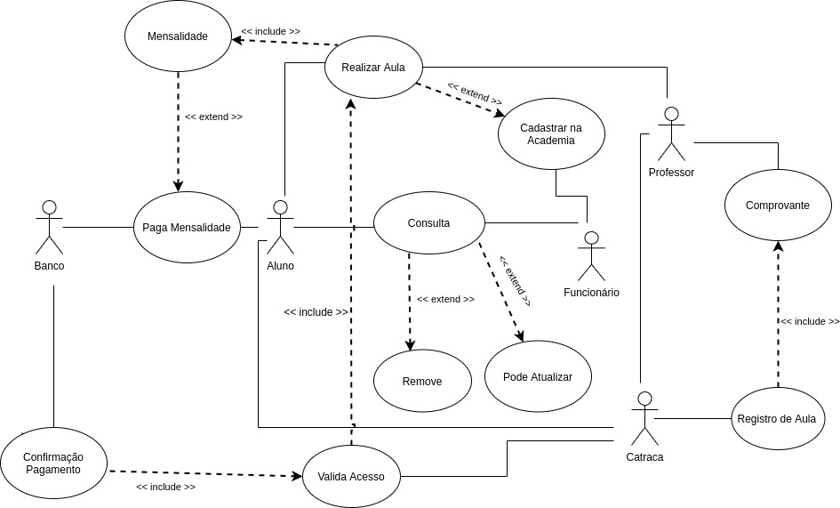

# Academia Cobra Kai
Sistema de gerenciamento de uma academia de artes marciais utilizando JAVA, SQL (Banco de Dados - MySQL) e Linguagem C (arduino). Maiores detalhes a respeito do [enunciado](PROJETO.pdf), [documentação](RAH%20-%20Desenvolvimento%20de%20Sistemas.pdf) e [apresentação do projeto](https://prezi.com/view/QVZTghRVZIM5FeBVW7Gn/) podem ser encontrados clicando nos links.

  

  

  

  

  

  

  

  

## Descrição do problema
 A Academia Cobra Kai necessita de um programa para gerenciamento da entrada de alunos, professores e a verificação do pagamento da mensalidade. O banco e responsável por disponibilizar uma planilha com as informações sobre o pagamento realizado pelos alunos.

 
  

 O modelo de gestão anterior da academia é de que o aluno deveria trazer consigo sua carteirinha e o comprovante de pagamento da mensalidade do mês vigente para que o mesmo possa adentrar a academia e frequentar as aulas. Porém a academia só teria a resposta oficial do banco no mês seguinte. Algumas das causas do problema são identificadas no diagrama de causa e efeito abaixo:

 
  

## Como executar

Para executar o código é necessário software MySQL executando em segundo plano, uma conexão de internet (envio de emails), versão 11 do compilador java e o nível de compilação deve ser maior ou igual a 1.8.

Todos os arquivos .java, .jar e .jpg devem estar no mesmo diretório que o arquivo executável.

* Caso seja executado no sistema operacional windows, execute o arquivo cobra_kai.bat em modo administrador.

* Caso executado no sistema operacional Linux, execute o comando `chmode +x cobra_kay.sh && ./cobra_kay.sh`.

* Caso executado no sistema operacional MAC, execute o comando `chmode +x cobra_kay.command && ./cobra_kay.command`.

Ao iniciar o programa solicita a senha do banco de dados (definido como padrão o endereço localhost (127.0.0.1)), caso a senha esteja incorreta, o programa não sincronizará mudanças nem carregará informações do banco de dados para manipulação.

## Licença
Este projeto está licenciado com a [licença MIT](LICENSE)

## Autores
- [Alcides Beato](https://github.com/alcidesbeato)
- [Henrique Siqueira](https://github.com/h-ssiqueira)
- [Rafael Barbon](https://github.com/RafaelBarbon)
